# Real-Time Monocular Depth Estimation on Apple Silicon

基于 Intel DPT-Large 的实时单目深度估计项目，支持 Mac 内置摄像头、外接 USB 摄像头以及可选的 Intel RealSense D435 对比诊断流程。项目重点优化 Apple Silicon Mac，包括 MPS GPU 加速、AVFoundation 摄像头后端和无需深度相机的纯 AI 深度估计方案。


## Project Highlights

- 实时深度估计：调用摄像头视频流，使用 `Intel/dpt-large` 生成伪彩色深度图。
- Apple Silicon 优化：自动检测 PyTorch MPS 后端，在 M1/M2/M3 Mac 上使用 GPU 加速。
- 无硬件依赖：核心功能不依赖 RealSense D435，仅使用普通 RGB 摄像头即可运行。
- 多模式显示：支持原图、深度图、并排对比、窗口缩放和单帧保存。
- D435 对比诊断：提供 D435 检测和 AI 深度图对比流程，适合研究和实验验证。
- 实验图表完整：包含消融实验、方法对比、损失函数、多尺度策略和推理性能图表。

## Demo

已有的运行结果示例：

<p align="center">
  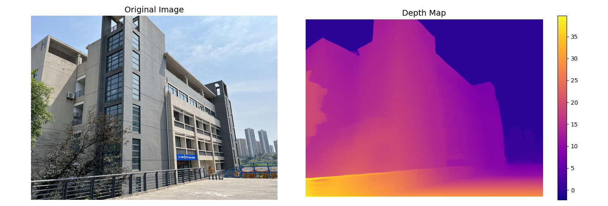
  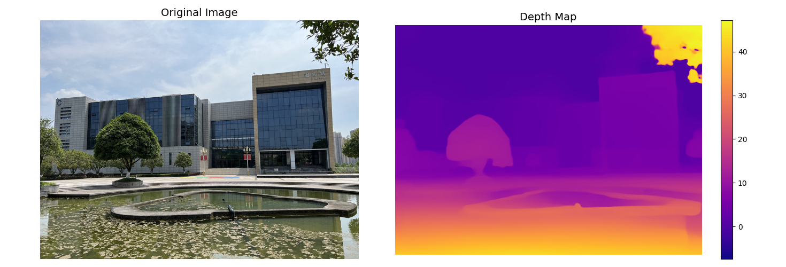
</p>

## Repository Structure

```text
depth/
├── README.md                 # GitHub 项目说明
├── README.original.md        # 原始 README 备份
├── run_final.py              # 实时 AI 深度估计主程序
├── run_comparison.py         # AI 深度图与 D435 对比程序
├── run_depth.py              # 单张图片深度估计
├── test_d435.py              # RealSense D435 诊断工具
├── lw.py                     # 实验图表生成脚本
├── test.jpg                  # 单张图片测试输入
├── comparison_*.png          # 运行输出示例
└── depth_charts/             # 实验图表
```

## Quick Start

### 1. Create Environment

```bash
conda create -n depth python=3.9
conda activate depth
```

### 2. Install Dependencies

Apple Silicon 推荐使用 PyTorch 对 macOS/MPS 的官方支持版本：

```bash
conda install pytorch torchvision torchaudio -c pytorch
pip install transformers opencv-python pillow matplotlib numpy
```

如果需要检测或尝试 RealSense D435，可额外安装：

```bash
pip install pyrealsense2
```

> 注：RealSense D435 在 Apple Silicon macOS 上可能存在 USB 权限、驱动兼容性或 `librealsense` 崩溃问题。纯 AI 深度估计流程不需要安装 D435 相关依赖。

### 3. Run Real-Time Depth Estimation

```bash
cd /Users/zzzhy/Desktop/depth
conda activate depth
python run_final.py
```

快捷键：

| Key | Action |
| --- | --- |
| `q` | 退出程序 |
| `s` | 保存当前帧 |
| `d` | 切换显示模式：并排 / 原图 / 深度图 |
| `+` / `-` | 调整窗口缩放 |

## Programs

### `run_final.py`

项目主程序，适合日常演示和实时运行。

- 使用 Mac 摄像头或外接 USB 摄像头采集 RGB 视频流。
- 调用 `Intel/dpt-large` 进行单目深度估计。
- 自动启用 MPS GPU；若不可用则回退 CPU。
- 输出原始画面、深度图或并排视图。
- 支持保存当前显示帧。

### `run_comparison.py`

用于 AI 单目深度估计与 RealSense D435 深度图的对比实验。

- 若检测不到 D435，会自动降级为纯 AI 模式。
- 支持 AI 模式、D435 模式和并排对比模式。
- 适合观察单目估计与真实深度传感器的差异。

快捷键：

| Key | Action |
| --- | --- |
| `q` | 退出程序 |
| `s` | 保存对比图 |
| `a` | 仅显示 AI 深度 |
| `d` | 仅显示 D435 深度，需设备可用 |
| `b` | AI 与 D435 并排显示 |

### `run_depth.py`

用于单张图片深度估计。

```bash
python run_depth.py
```

默认读取当前目录下的 `test.jpg`。该脚本使用 Hugging Face 离线模式加载模型，因此需要本地已有 `Intel/dpt-large` 缓存；首次运行可先通过 `run_final.py` 或联网环境下载模型。

### `test_d435.py`

RealSense D435 诊断工具，用于检查 `pyrealsense2`、设备连接和当前系统架构。

```bash
python test_d435.py
```

## Experiment Charts

项目包含一组用于说明算法机制和实验结论的图表，位于 `depth_charts/`。

### Ablation Study

<p align="center">
  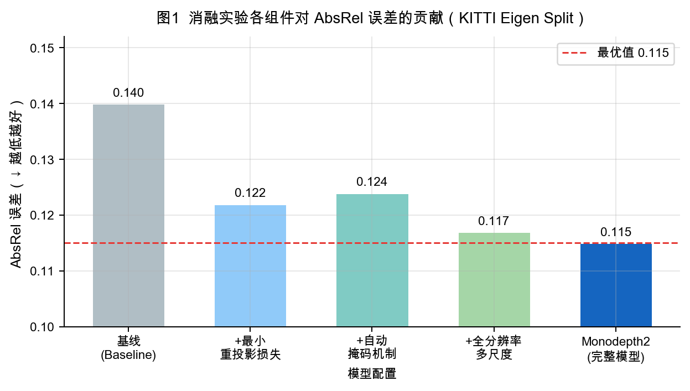
  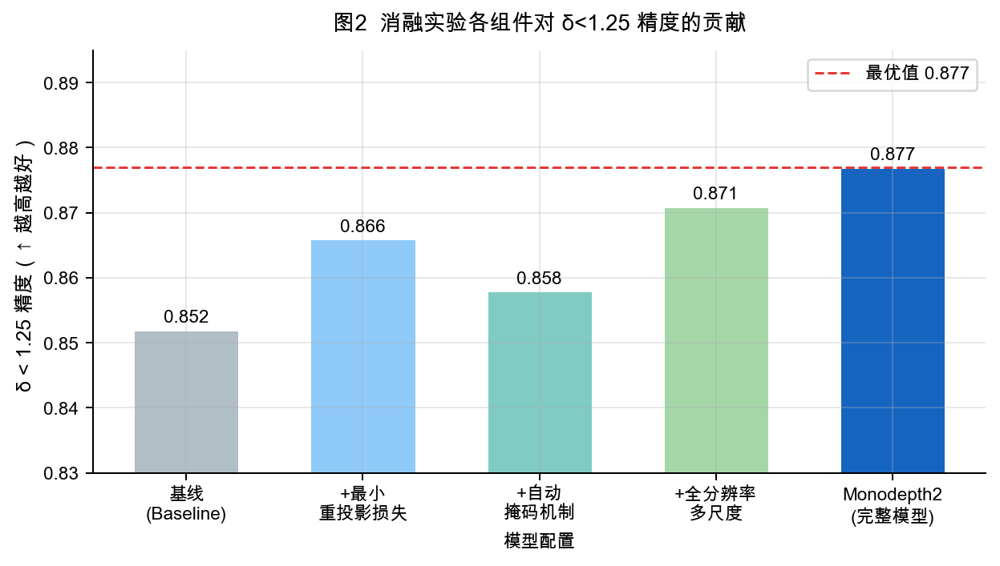
</p>

消融实验展示了最小重投影损失、自动掩码机制、全分辨率多尺度策略等组件对 AbsRel 误差和 `δ < 1.25` 精度的影响。

### Method Comparison

<p align="center">
  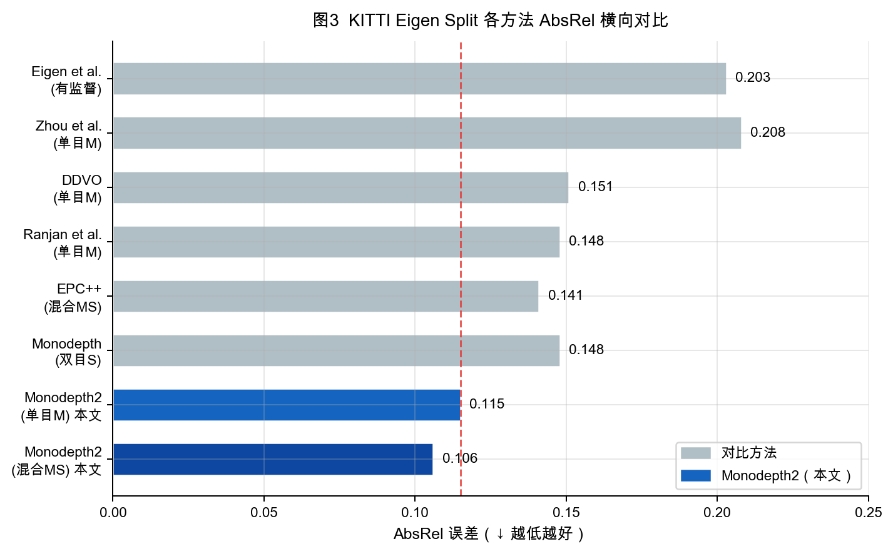
</p>

横向对比展示了 Monodepth2 系列方法与多种主流深度估计方法在 KITTI Eigen Split 上的 AbsRel 表现。

### Loss Functions and Training Mechanisms

<p align="center">
  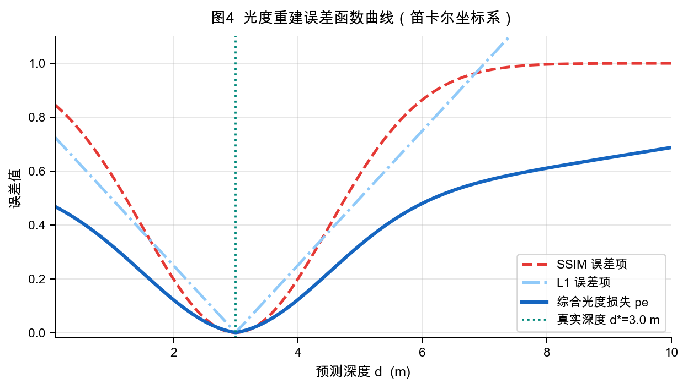
  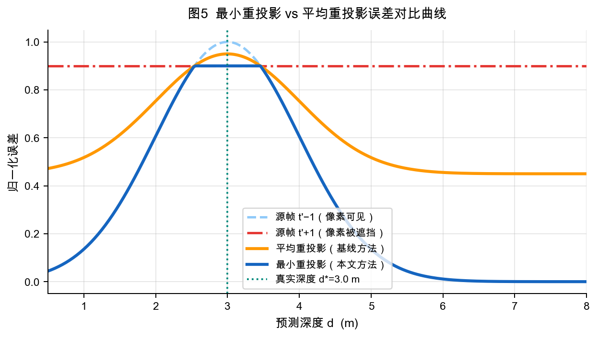
  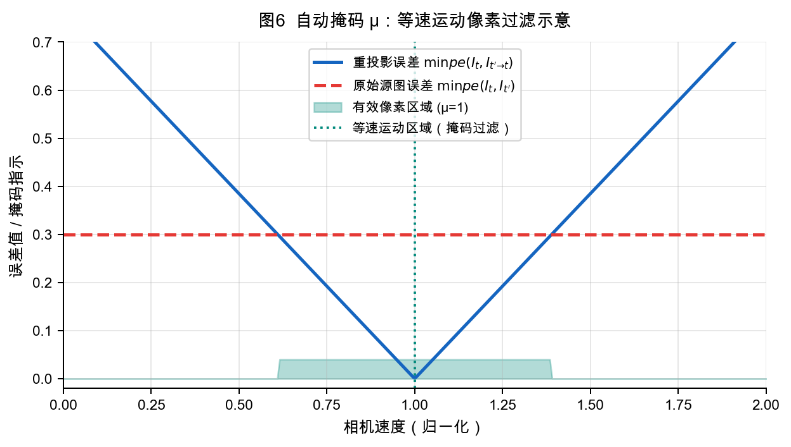
  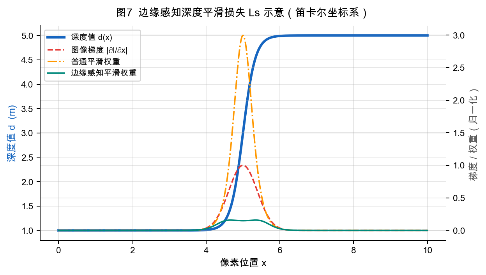
</p>

这些图表说明光度重建误差、最小重投影、自动掩码和边缘感知平滑损失在自监督单目深度估计中的作用。

### Architecture, Convergence and Performance

<p align="center">
  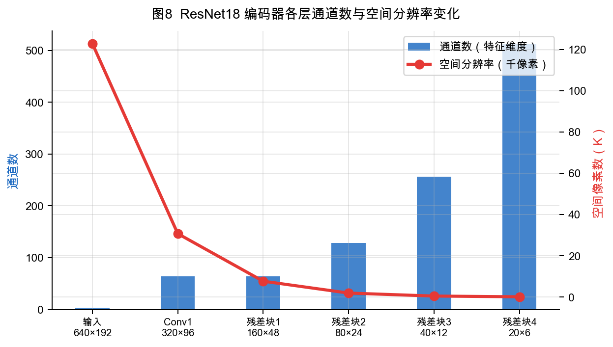
  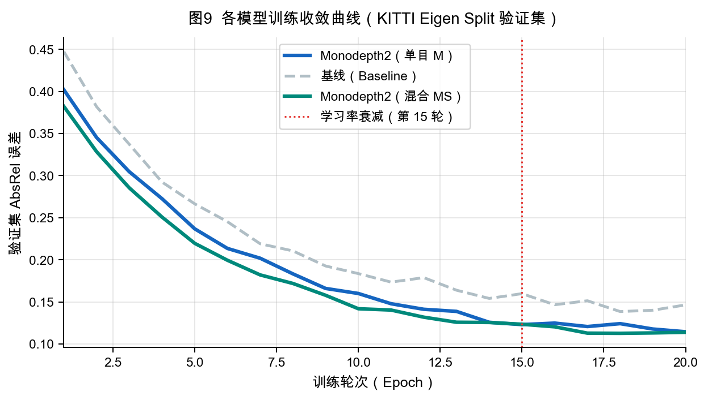
  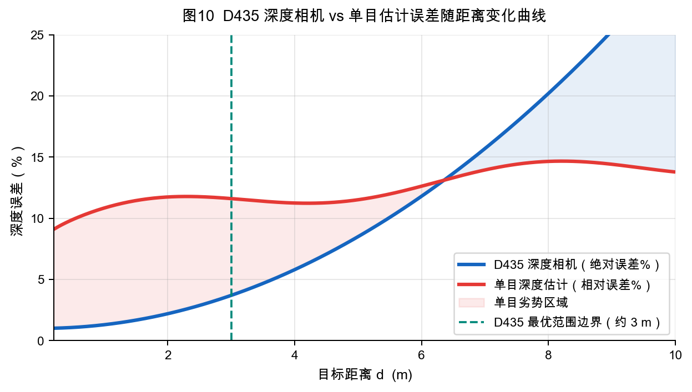
  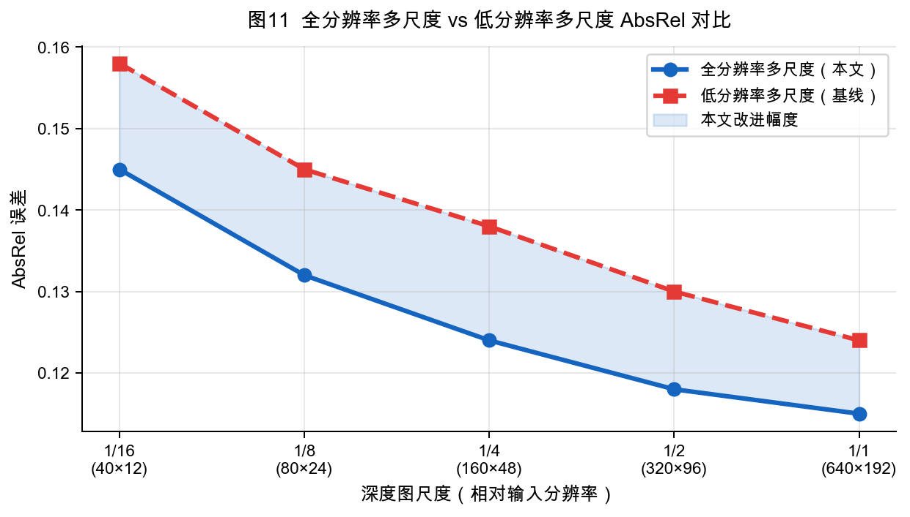
  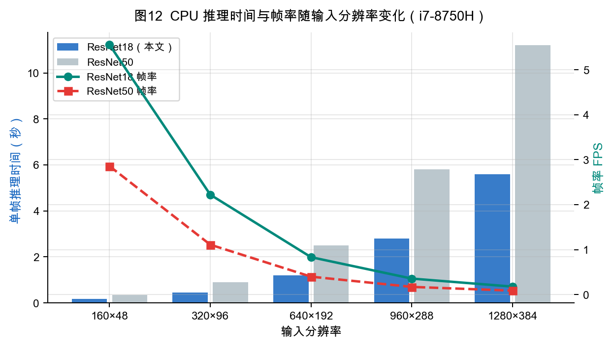
</p>

这些图表覆盖编码器维度变化、训练收敛趋势、D435 与单目估计误差差异、多尺度训练策略和 CPU 推理性能。

## Technical Notes

### Depth Estimation Pipeline

```text
Camera Frame
    ↓
RGB Preprocessing
    ↓
DPT-Large Inference
    ↓
Depth Prediction Upsampling
    ↓
Normalization and Color Mapping
    ↓
OpenCV Real-Time Display
```

### Device Selection

程序会自动选择可用推理设备：

```python
device_name = "mps" if torch.backends.mps.is_available() else "cpu"
```

在 Apple Silicon Mac 上，MPS 后端可显著提升实时推理体验；在非 Apple Silicon 或 MPS 不可用环境中，程序会自动使用 CPU。

### Camera Backend

实时程序优先使用 macOS 的 AVFoundation 后端：

```python
cv2.VideoCapture(i, cv2.CAP_AVFOUNDATION)
```

如果 AVFoundation 打开失败，会回退到 OpenCV 默认摄像头后端。

## RealSense D435 on macOS

在 Apple Silicon macOS 上，RealSense D435 可能出现以下问题：

- `failed to set power state`
- USB 权限受限
- `pyrealsense2` 或 `librealsense` 崩溃
- 设备可检测但无法稳定读取深度帧

推荐方案：

1. 优先使用 `run_final.py` 的纯 AI 深度估计流程。
2. 使用 `test_d435.py` 检查 D435 与 Python 绑定状态。
3. 如确需 D435 数据，建议在 Linux / Ubuntu 环境中运行，或从源码编译 `librealsense`。

## Troubleshooting

### Cannot Open Camera

请检查 macOS 摄像头权限：

```text
System Settings -> Privacy & Security -> Camera
```

确认 Terminal、VS Code 或当前 IDE 已获得摄像头权限，并关闭 Zoom、FaceTime、微信等可能占用摄像头的程序。

### Model Download Is Slow

`Intel/dpt-large` 首次运行需要从 Hugging Face 下载。下载完成后会缓存在本地，后续运行可直接复用缓存。

### `run_depth.py` Cannot Load Model

`run_depth.py` 默认开启离线模式，请先确保本地已有 `Intel/dpt-large` 模型缓存。可以先联网运行一次 `run_final.py` 完成模型下载。

### D435 Is Not Available

这通常不是项目代码问题，而是 Apple Silicon macOS 与 RealSense 驱动栈的兼容性问题。实时 AI 深度估计不依赖 D435，可直接使用普通摄像头运行。

## Recommended Use Cases

| Scenario | Recommended Script |
| --- | --- |
| 实时演示单目深度估计 | `run_final.py` |
| 保存当前深度估计结果 | `run_final.py` / `run_comparison.py` |
| 对比 AI 深度与 D435 深度 | `run_comparison.py` |
| 处理单张测试图片 | `run_depth.py` |
| 检查 RealSense 设备状态 | `test_d435.py` |
| 重新生成实验图表 | `lw.py` |

## Roadmap

- 增加视频文件输入和输出保存。
- 增加可配置模型选择，例如 DPT-Hybrid、MiDaS small 等轻量模型。
- 增加 FPS、分辨率和推理耗时统计面板。
- 增加批量图片深度估计脚本。
- 改进 D435 在非 macOS 环境下的真实深度对齐与标定流程。

## License

本项目仅用于学习、课程实验和研究展示。

## Acknowledgements

- [Intel DPT-Large](https://huggingface.co/Intel/dpt-large)
- [Hugging Face Transformers](https://github.com/huggingface/transformers)
- [PyTorch](https://pytorch.org/)
- [OpenCV](https://opencv.org/)
- [Intel RealSense SDK](https://github.com/IntelRealSense/librealsense)
